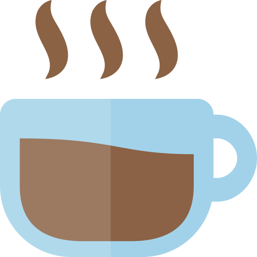

<div align="center">
    <a href="https://github.com/sotlucas/dotfiles">
        
    </a>
    <br />
    <h2> sotlucas' dotfiles </h2>
</div>

<div align="center">

_Here I'll keep and update all my dotfiles :D_

</div>

## Installation

To install just clone the repo and run the install.sh script with the following commands
```
git clone https://github.com/sotlucas/dotfiles ~/.dotfiles
cd ~/.dotfiles
chmod +x install.sh
./install.sh
```
This will create a `~/.dotfiles` directory where all the configurations will live.

## Plugins

These are the plugins I have installed.

* Pathogen (plugin installer)
```
mkdir -p ~/.vim/autoload ~/.vim/bundle && \
curl -LSso ~/.vim/autoload/pathogen.vim https://tpo.pe/pathogen.vim
```

* gruvbox
```
cd ~/.vim/bundle
git clone https://github.com/morhetz/gruvbox
```

* vim-airline
```
cd ~/.vim/bundle
git clone https://github.com/vim-airline/vim-airline
```

* tmuxline.vim
```
cd ~/.vim/bundle
git clone https://github.com/edkolev/tmuxline.vim
```

* command-t
```
cd ~/.vim/bundle
git clone https://github.com/wincent/command-t
```


