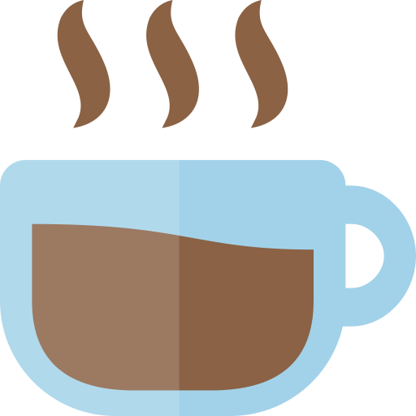

<div align="center">
    <a href="https://github.com/sotlucas/dotfiles">
        
    </a>
    <br />
    <h1> sotlucas' dotfiles </h1>
</div>

<div align="center">

_Here I'll keep and update all my dotfiles :D_

</div>

## Installation

> **WARNING**: This will remove your current dotfiles. Make sure to backup your files before installing!!

To install just clone the repo and run the `install.sh` script with the following commands
```
git clone https://github.com/sotlucas/dotfiles ~/.dotfiles
cd ~/.dotfiles
chmod +x install.sh
./install.sh
```
This will create a `~/.dotfiles` directory where all the configurations will live.

## Updating

To update the files and the plugins first go to the dotfiles directory and give permissions to the `update.sh` script:
```
cd ~/.dotfiles
chmod +x update.sh
```
Then just run
```
./update.sh
```
This will also install missing plugins.

## Vim Plugins

Here is a list of the plugins I have installed for Vim.

* [pathogen.vim](https://github.com/tpope/vim-pathogen) (plugin installer)
* [gruvbox](https://github.com/morhetz/gruvbox)
* [vim-airline](https://github.com/vim-airline/vim-airline)
* [tmuxline.vim](https://github.com/edkolev/tmuxline.vim)
* [command-t](https://github.com/wincent/command-t)
* [ultisnips](https://github.com/sirver/ultisnips)
* [sorround.vim](https://github.com/tpope/vim-surround)
